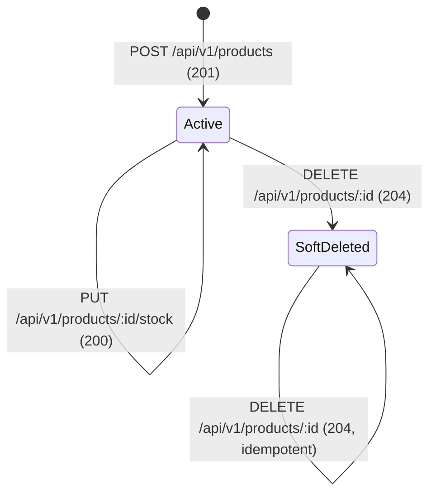

# Data Model: Product CRUD API

**Date**: 2026-06-12 | **Feature**: [spec.md](spec.md)

## Entities

### Product

Represents an item in the e-commerce product catalog.

| Field          | Type             | Constraints                 | Description                           |
| -------------- | ---------------- | --------------------------- | ------------------------------------- |
| `id`           | `INTEGER`        | Primary key, auto-increment | Unique identifier                     |
| `productToken` | `UUID`           | NOT NULL, UNIQUE index      | Client-provided UUID v4 token         |
| `name`         | `STRING`         | NOT NULL                    | Product display name (non-empty)      |
| `price`        | `DECIMAL(10, 4)` | NOT NULL, >= 0              | Unit price with 4 decimal places      |
| `stock`        | `INTEGER`        | NOT NULL, >= 0              | Available inventory quantity          |
| `createdAt`    | `TIMESTAMP`      | NOT NULL, auto-generated    | Record creation time                  |
| `updatedAt`    | `TIMESTAMP`      | NOT NULL, auto-generated    | Last modification time                |
| `deletedAt`    | `TIMESTAMP`      | NULL                        | Soft-delete timestamp (paranoid mode) |

### Indexes

| Index Name               | Columns        | Type        | Purpose                                    |
| ------------------------ | -------------- | ----------- | ------------------------------------------ |
| `PRIMARY`                | `id`           | Primary key | Row identification                         |
| `products_product_token` | `productToken` | Unique      | Enforce token uniqueness, optimize lookups |

### Relationships

None. Product is a standalone entity with no foreign keys.

## State Transitions

- **Active**: `deletedAt` is `NULL`. Product is visible in listings and retrievable by ID.
- **Soft-Deleted**: `deletedAt` is set. Product is excluded from listings and returns 404 on direct retrieval. Stock updates return 404.

## Validation Rules

### Creation (POST /api/v1/products)

| Field          | Rule                                                  |
| -------------- | ----------------------------------------------------- |
| `name`         | Required, must be a non-empty string                  |
| `productToken` | Required, must be a valid UUID v4                     |
| `price`        | Required, must be a number >= 0, max 4 decimal places |
| `stock`        | Required, must be an integer >= 0                     |

### Stock Update (PUT /api/v1/products/:id/stock)

| Field   | Rule                              |
| ------- | --------------------------------- |
| `stock` | Required, must be an integer >= 0 |

### Pagination (GET /api/v1/products)

| Parameter | Rule                                           |
| --------- | ---------------------------------------------- |
| `page`    | Optional, integer >= 1, default: 1             |
| `limit`   | Optional, integer >= 1 and <= 100, default: 20 |

## Sequelize Model Configuration

- **Table name**: `products`
- **Paranoid mode**: `true` (enables automatic soft-delete via `deletedAt`)
- **Timestamps**: `true` (auto-manages `createdAt` and `updatedAt`)
- **Underscored**: `false` (use camelCase column names as defined)
